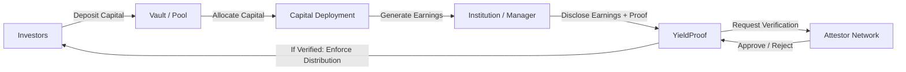

# YieldProof  
**On-chain accountability for institutional yield**

YieldProof is a verification and enforcement layer that makes yield disclosures **provable, independently verified, and enforceable on-chain**.

> - Capital is on-chain.  
> - Verification is still trust-based.  
> - **YieldProof fixes that.**


## 🚨 The Problem

Today, institutional and DeFi yield flows look like this:

- Investors deposit capital on-chain  
- Funds are deployed into strategies, RWAs, or protocols  
- Earnings are **self-reported off-chain**  
- Distribution relies on trust, PDFs, or delayed reports  

This leads to:
- Opaque performance reporting  
- No independent verification  
- No accountability for misreporting  
- No on-chain enforcement  

**Capital is transparent. Yield verification is not.**

---

## ✅ The Solution: YieldProof

YieldProof introduces **proof-based yield disclosure**:

1. Institutions disclose realized earnings with cryptographic proof  
2. Independent attestors verify disclosures by staking capital  
3. Verified disclosures trigger automatic on-chain distribution  
4. Fraud or negligence results in slashing  

**Truth is enforced by incentives, not trust.**

---

### 🔄 How YieldProof Works



---

## 🔗 Demo & Resources

- Live MVP: https://yield-proof.vercel.app
- Demo Video: 

### 🛠️ Run Locally

```
git clone https://github.com/your-org/yieldproof.git
cd yieldproof
npm install
```

**Create a .env file:**
```
NEXT_PUBLIC_RPC_URL=https://rpc.sepolia.mantle.xyz
NEXT_PUBLIC_YIELDPROOF_CONTRACT=0xYourContractAddress
```

**Run the app:**
```
npm run dev
```
Open http://localhost:3000

---

## 👥 Team
- Mouli
- Jishnu
- Manish
