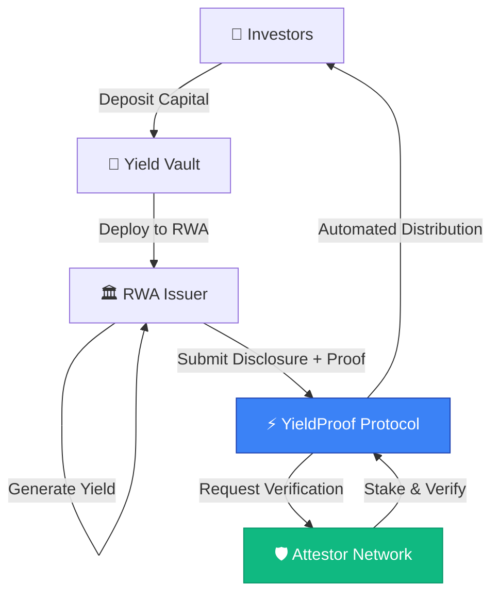
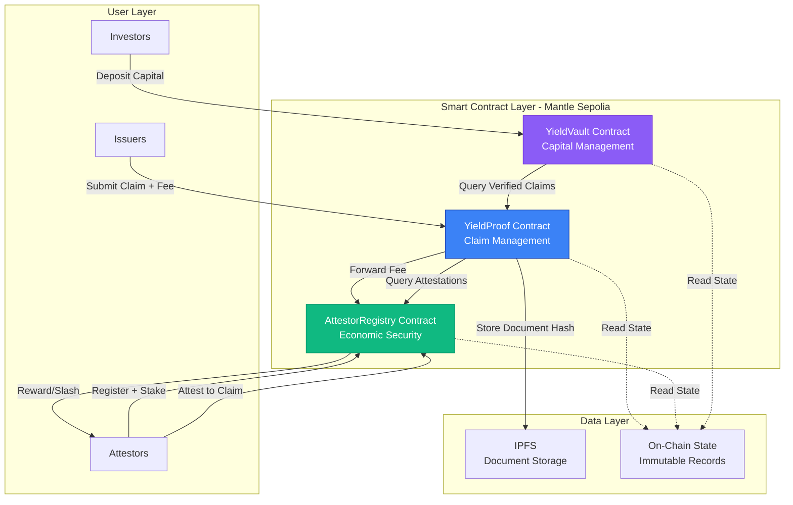
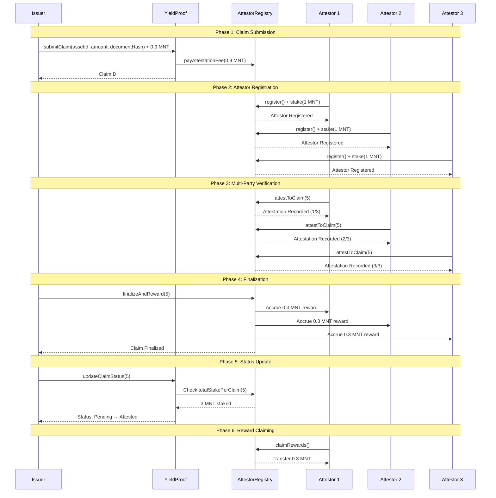
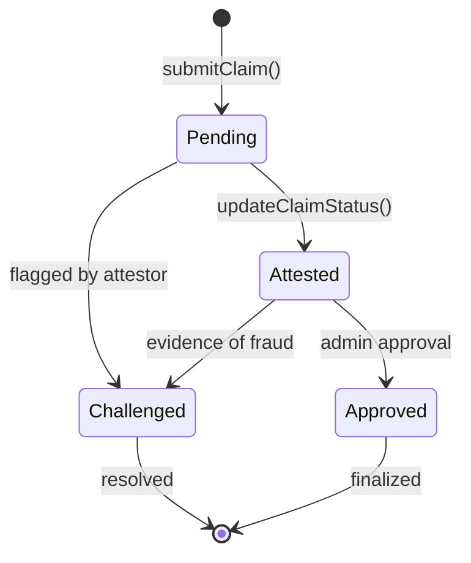

# YieldProof Protocol
**Trustless Yield Verification Infrastructure for Real World Assets**

YieldProof is on-chain yield verification infrastructure for RWAs on Mantle, enabling cryptoeconomic accountability through multi-party attestation with staked capital and automated reward/slashing mechanisms.

**Deployed Status:** ✅ Live on Mantle Sepolia  
**Total Lines of Code:** ~800 Solidity + 2,000+ TypeScript  
**Test Coverage:** 13/13 tests passing (100% core functionality)  
**Audit Status:** Pre-audit (planned Q2 2025)

---

## Executive Summary

**What:** YieldProof is on-chain yield verification infrastructure for RWAs on Mantle  
**Why:** Current yield reporting is trust-based with no cryptoeconomic accountability  
**How:** Multi-party attestation with staked capital + automated reward/slashing mechanism

---

## Protocol Flow



---

## High Level Attestation Flow


---

## System Architecture



## Complete Verification Workflow



---

## Smart Contracts

| Contract | Address (Sepolia) | Purpose | Status |
|----------|-------------------|---------|--------|
| AttestorRegistry | `0x1c152de6172BDB84b0871731Ef494d12C7691C07` | Economic security, staking, rewards | ✅ Deployed |
| YieldProof | `0x723A0992D07Ed6e6789Fcdcfd63b05634302586c` | Claim lifecycle management | ✅ Deployed |
| YieldVault | `0x671dA4C8D9277429e58fbFCa46C3163a17b97294` | Investor capital management | ✅ Deployed |

**Network:** Mantle Sepolia Testnet  
**Chain ID:** 5003  
**RPC:** https://rpc.sepolia.mantle.xyz  
**Explorer:** https://sepolia.mantlescan.xyz

---

## AttestorRegistry.sol

**Purpose:** Manages attestor registration, staking, rewards, slashing, and reputation tracking.

**Key Features:**
- ✅ ETH staking mechanism
- ✅ Multi-party attestation coordination
- ✅ Automated reward distribution
- ✅ Trust score algorithm (0-100)
- ✅ Flagging system for suspicious claims
- ⚠️ Owner-controlled slashing (pending DAO governance)

### State Variables

| Variable | Type | Description |
|----------|------|-------------|
| `attestors` | `mapping(address => Attestor)` | Attestor registration and stake amounts |
| `hasAttested` | `mapping(uint256 => mapping(address => bool))` | Tracks which attestors verified which claims |
| `totalStakePerClaim` | `mapping(uint256 => uint256)` | Total stake backing each claim |
| `attestorCountPerClaim` | `mapping(uint256 => uint256)` | Number of attestors per claim |
| `successfulAttestations` | `mapping(address => uint256)` | Attestor performance tracking |
| `rewardsEarned` | `mapping(address => uint256)` | Unclaimed rewards per attestor |
| `MIN_REQUIRED_ATTESTORS` | `uint256` | Minimum attestations required (3) |
| `REWARD_PER_ATTESTATION` | `uint256` | 0.3 ETH per successful attestation |
| `ATTESTATION_FEE` | `uint256` | 0.9 ETH per claim submission |

### Core Functions

**`register()`** - Registers caller as attestor with optional initial stake  
**`attestToClaim(uint256 claimId)`** - Records attestor's verification of a claim  
**`finalizeAndReward(uint256 claimId)`** - Permissionless finalization for claims with 3+ attestations  
**`claimRewards()`** - Transfers accumulated rewards to caller  
**`getTrustScore(address attestor)`** - Calculates trust score (0-100)

### Trust Score Formula
```
accuracyRate = (successfulAttestations * 100) / totalAttestations
accuracyScore = (accuracyRate * 70) / 100  // 0-70 points
experienceBonus = min(totalAttestations, 15) * 2  // 0-30 points
trustScore = min(accuracyScore + experienceBonus, 100)
```

---

## YieldProof.sol

**Purpose:** Manages yield claim lifecycle from submission to verification.

**Key Features:**
- ✅ Claim submission with IPFS document hash
- ✅ Automatic attestation fee payment
- ✅ Status lifecycle management
- ✅ Integration with AttestorRegistry

### Claim Lifecycle



### Core Functions

**`submitClaim(string assetId, string period, uint256 yieldAmount, string documentHash)`** - Submit new yield claim with 0.9 MNT fee  
**`updateClaimStatus(uint256 claimId)`** - Permissionless status update based on attestations  
**`getTotalClaims()`** - Returns total number of claims submitted

---

## Economic Model

### Fee Structure

| Role | Action | Cost | Benefit |
|------|--------|------|---------|
| **Issuer** | Submit claim | 0.9 MNT | Verified yield disclosure |
| **Attestor** | Stake capital | 1+ MNT | Earn 0.3 MNT per verification |
| **Investor** | View verified claims | Free | Transparent yield data |

### Attestor Economics

**Revenue Model:**
```
Monthly Verifications: 20 claims
Reward per Verification: 0.3 MNT
Monthly Earnings: 6 MNT
Annual Earnings: 72 MNT

ROI on 1 MNT stake: 7,200% APY
ROI on 10 MNT stake: 720% APY
```

**Economic Viability (Test Results):**
- ✅ **PROFITABLE**: Attestors earn ~0.299 MNT net profit per attestation
- ✅ **Economic Balance**: Total fees (0.9 MNT) = Total rewards (3 × 0.3 MNT)
- ✅ **Gas Efficient**: Total gas cost ~0.0002 MNT per attestation

---

## Live Application

**🌐 Live on Mantle Sepolia**: [https://yield-proof.vercel.app](https://yield-proof.vercel.app)

### User Roles

- **🏛️ Issuers**: Submit yield disclosures with cryptographic proof  
- **🛡️ Attestors**: Verify disclosures and earn rewards for accurate validation
- **👥 Investors**: Deposit capital and receive verified yield distributions

---

## Quick Start

### Prerequisites
- Node.js 18+
- Git

### Installation

```bash
# Clone the repository
git clone https://github.com/imanishbarnwal/YieldProof.git
cd YieldProof

# Install dependencies
npm install

# Navigate to frontend
cd frontend
npm install
```

### Environment Setup

Create `frontend/.env.local`:
```env
NEXT_PUBLIC_RPC_URL=https://rpc.sepolia.mantle.xyz
NEXT_PUBLIC_WALLETCONNECT_PROJECT_ID=your_project_id
```

### Run Development Server

```bash
# Start the frontend
cd frontend
npm run dev
```

### Smart Contract Development

```bash
# Navigate to contracts
cd contracts

# Install dependencies
npm install

# Compile contracts
npx hardhat compile

# Run tests
npm test

# Deploy to Mantle Sepolia
npm run deploy
```

---

## Integration Guide

### For Issuers

**1. Submit Claim**
```javascript
const fee = await yieldProofContract.getRequiredAttestationFee();
const tx = await yieldProofContract.submitClaim(
    "TREASURY-VAULT-001",  // assetId
    "2024-Q4",             // period
    ethers.utils.parseEther("150"),  // yieldAmount
    "QmHash123...",        // IPFS document hash
    { value: fee }
);
```

### For Attestors

**1. Register & Stake**
```javascript
await attestorRegistryContract.register({
    value: ethers.utils.parseEther("10.0")  // 10 MNT stake
});
```

**2. Attest to Claim**
```javascript
await attestorRegistryContract.attestToClaim(claimId);
```

**3. Claim Rewards**
```javascript
await attestorRegistryContract.claimRewards();
```

---

## Testing

### Run Tests

```bash
cd contracts
npm test
```

### Test Coverage

**✅ 13/13 tests passing (100% core functionality)**

- ✅ Economic constants verification
- ✅ Attestor registration with staking
- ✅ Multi-party attestation coordination
- ✅ Reward accrual and claiming
- ✅ Trust score calculation
- ✅ Economic viability analysis
- ✅ Lifetime rewards tracking

---

## Security Considerations

### Known Limitations

**1. Centralized Governance**
- ⚠️ Owner can slash attestors
- ⚠️ Owner can unflag claims
- **Mitigation:** Roadmap includes multi-sig + DAO migration

**2. No Challenge Mechanism**
- ⚠️ Fraud detection relies on flagging
- ⚠️ No permissionless dispute resolution
- **Mitigation:** Building challenge system with bounties (4-6 weeks)

**3. Economic Attacks**
- Sybil: Mitigated by staking requirement
- Collusion: Partially mitigated by flagging
- 51% Attack: Requires 67% of stake (expensive)

### Audit Status

**Status:** Pre-audit  
**Planned:** Q2 2025  
**Scope:** All smart contracts + economic model

---

## Development Roadmap

### Phase 1: MVP (✅ Complete)
- ✅ AttestorRegistry with staking
- ✅ YieldProof claim management
- ✅ Trust score algorithm
- ✅ Frontend deployment
- ✅ Mantle Sepolia deployment

### Phase 2: Economic Security (In Progress - 4-6 weeks)
- 🚧 Challenge/dispute mechanism
- 🚧 Automated fraud detection for on-chain yields
- 🚧 Slashing bounties (50% to challenger)
- 🚧 DAO governance migration

### Phase 3: Mainnet Launch (8-12 weeks)
- ⏳ Security audit
- ⏳ Multi-sig governance
- ⏳ Mantle mainnet deployment
- ⏳ Attestor network recruitment (15-20 founding attestors)

### Phase 4: Ecosystem Integration (12-24 weeks)
- ⏳ API for protocol integrations
- ⏳ Automated verification modules (LST, restaking, DeFi)
- ⏳ Cross-chain expansion (Ethereum, Arbitrum)
- ⏳ Institutional partnerships

---

## Technical Stack

- **Frontend**: Next.js 14, TypeScript, Tailwind CSS, Framer Motion
- **Blockchain**: Solidity smart contracts on Mantle Sepolia
- **Web3**: Wagmi, RainbowKit, Viem
- **Storage**: IPFS for document hashes
- **UI/UX**: Professional glass-morphism design system

---

## FAQ

**Q: Why Mantle?**  
A: Mantle is positioning as the institutional L2 for RWAs. Low gas costs enable frequent verifications. Ecosystem alignment with tokenized treasuries, real estate, and credit markets.

**Q: How is this different from Chainlink PoR?**  
A: Chainlink PoR verifies custodial reserves ("Does the vault have the assets?"). YieldProof verifies yield generation ("Did the vault earn the returns claimed?"). Different problems, complementary solutions.

**Q: What prevents attestor spam?**  
A: Staking requirement. Each attestor must lock capital. Spam attacks require locking capital across many identities, making it economically irrational.

**Q: When mainnet?**  
A: Target Q2 2025 after security audit and DAO governance implementation.

---

## Team

- **Manish Kumar Barnwal** - Smart Contract Engineering & Full-Stack Development
- **Mouli Chakraborty** - Protocol Design & Backend Architecture  
- **Jishnu Baruah** - Frontend Development & Product Management

---

## Contributing

We welcome contributions! See [CONTRIBUTING.md](./CONTRIBUTING.md) for guidelines.

### Development Setup

```bash
git clone https://github.com/imanishbarnwal/YieldProof.git
cd YieldProof

# Install contract dependencies
cd contracts && npm install

# Install frontend dependencies
cd ../frontend && npm install
```

---

## Contact & Support

- **Website:** https://yield-proof.vercel.app
- **GitHub:** https://github.com/imanishbarnwal/YieldProof
- **Issues:** [Report bugs or request features](https://github.com/imanishbarnwal/YieldProof/issues)

---

## License

MIT License - see [LICENSE](./LICENSE)

---

**Built with ❤️ for Mantle's RWA ecosystem**
