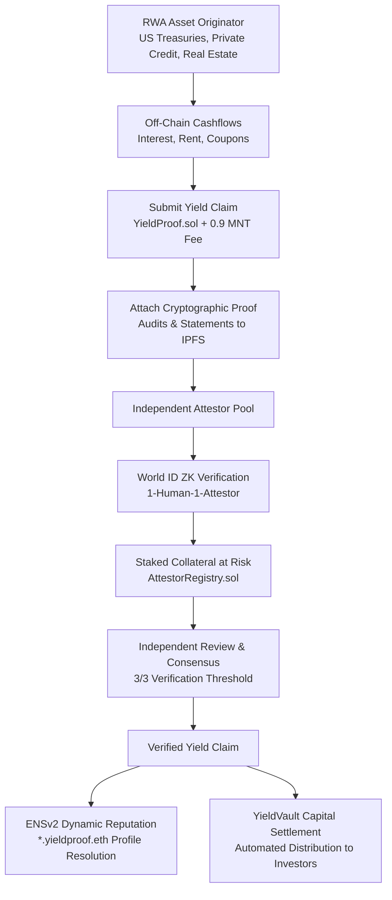

# YieldProof

> YieldProof is an on-chain RWA yield verification protocol that combines economically accountable attestations with unique-human verification and portable attestor reputation.

**ETHGlobal Tokyo 2026 Submission Tracks:**
1. **World** — Best Use of IDKit
2. **ENS** — Best Use of ENSv2
3. **Curvegrid** — Best RWA Tokenization Project

---

## 1. The Problem: The RWA Oracle & Verification Gap

Real-World Asset (RWA) tokenization is bridging sovereign debt, private credit, and real estate onto public blockchains. However, a critical structural challenge persists: **RWA yield generation occurs off-chain** (in commercial bank accounts, special purpose legal entities, and institutional custodian vaults).

Current RWA yield reporting suffers from:
* **Single-Issuer Trust**: Protocols rely on self-reported disclosure data from asset originators with no decentralized validation.
* **No Cryptoeconomic Accountability**: Traditional oracles cannot natively inspect off-chain accounting disclosures or legal audit pdfs.
* **Sybil Vulnerability**: Unrestricted decentralized voting networks can be captured by a single malicious actor spinning up multiple automated wallets.

---

## 2. The Solution: YieldProof

YieldProof introduces a cryptoeconomically secured verification pipeline for tokenized Real-World Assets:
1. **Evidence-Backed Yield Disclosures**: Issuers submit quantitative yield claims backed by immutable IPFS cryptographic evidence (auditor statements, bank receipts).
2. **World ID Proof of Personhood**: Attestor nodes must be verified unique humans via World ID zero-knowledge proofs, eliminating Sybil attack vectors.
3. **Staked Multi-Party Consensus**: Independent attestors risk their own staked capital (`MNT`) to review evidence and vote on yield accuracy.
4. **ENSv2 Portable Reputation Layer**: Each attestor is issued an ENSv2 subname (`attestor-007.yieldproof.eth`) that dynamically resolves their on-chain accuracy, trust score, and verification history.
5. **Downstream Capital Vault Settlement**: Verified disclosures trigger automated on-chain yield distributions to institutional liquidity pools in `YieldVault.sol`.

---

## 3. Why RWA Yield Verification Matters

Tokenized assets cannot scale to institutional volumes without verifiable provenance. YieldProof ensures that:
* **LPs and Investors** receive programmatic assurance that reported yields correspond to audited off-chain revenue.
* **Asset Issuers** establish provable credibility and transparency for their tokenized debt or credit vehicles.
* **Protocols & DeFi Composability** can safely build lending and structured products on top of verified RWA cashflows.

---

## 4. Complete Verification Pipeline


```mermaid
graph TD
    A[RWA Asset Originator<br/>US Treasuries, Private Credit, Real Estate] --> B[Off-Chain Cashflows<br/>Interest, Rent, Coupons]
    B --> C[Submit Yield Claim<br/>YieldProof.sol + 0.9 MNT Fee]
    C --> D[Attach Cryptographic Proof<br/>Audits & Statements to IPFS]
    D --> E[Independent Attestor Pool]
    E --> F[World ID ZK Verification<br/>1-Human-1-Attestor]
    F --> G[Staked Collateral at Risk<br/>AttestorRegistry.sol]
    G --> H[Independent Review & Consensus<br/>3/3 Verification Threshold]
    H --> I[Verified Yield Claim]
    I --> J[ENSv2 Dynamic Reputation<br/>*.yieldproof.eth Profile Resolution]
    I --> K[YieldVault Capital Settlement<br/>Automated Distribution to Investors]
```

---

## 5. System Components & Sponsor Integrations

### A. World ID Integration (Proof of Personhood)
* **Sybil Defense**: Attestors must present a valid ZK-SNARK proof of humanness generated via IDKit before onboarding.
* **Nullifier Hash Tracking**: Action-scoped nullifiers (`nullifierHashes` mapping on-chain) guarantee that 1 physical human can never register multiple attestor identities.
* **Zero PII Exposure**: No biometric data or personal identifying information is stored or transmitted on-chain.
* **Documentation**: [`docs/WORLD_ID_INTEGRATION.md`](docs/WORLD_ID_INTEGRATION.md)

### B. ENSv2 Dynamic Identity & Reputation Layer
* **Subname Issuance**: Approved attestors receive portable subnames under `*.yieldproof.eth` (e.g. `attestor-007.yieldproof.eth`).
* **Dynamic Resolver (`IENSResolver`)**: Implements `addr(bytes32)` and `text(bytes32, string)` to query `AttestorRegistry` in real-time without requiring expensive gas writes on every vote:
  - `addr` $\rightarrow$ Attestor wallet address
  - `app/yieldproof/status` $\rightarrow$ `"Active"` | `"Inactive"`
  - `app/yieldproof/trust-score` $\rightarrow$ Accuracy score (0–100)
  - `app/yieldproof/world-verified` $\rightarrow$ `"true"` (ZK Proof)
  - `app/yieldproof/claims-verified` $\rightarrow$ Count of verified RWA claims
  - `app/yieldproof/stake` $\rightarrow$ Active staked collateral
* **Documentation**: [`docs/ENSV2_INTEGRATION.md`](docs/ENSV2_INTEGRATION.md)

### C. RWA Tokenization Infrastructure (Curvegrid Track)
* **Immutable Document Commitment**: IPFS content hashes bound to on-chain claim identifiers.
* **Dispute & Slashing Protection**: Attestors can call `flagClaim(claimId, reason)` to halt suspicious claims. Dishonest attestors face stake slashing via `slash()`.
* **Automated Capital Settlement**: `YieldVault.sol` releases verified yield returns to liquidity providers upon consensus finalization.
* **Documentation**: [`docs/RWA_ARCHITECTURE.md`](docs/RWA_ARCHITECTURE.md)

---

## 6. Smart Contracts Overview

| Contract | Address (Mantle Sepolia) | Role |
| :--- | :--- | :--- |
| **`YieldProof.sol`** | `0x723A0992D07Ed6e6789Fcdcfd63b05634302586c` | RWA yield claim registry, fee collection, lifecycle state machine |
| **`AttestorRegistry.sol`** | `0x1c152de6172BDB84b0871731Ef494d12C7691C07` | World ID nullifier tracking, staking collateral, consensus voting, reward payouts, slashing |
| **`YieldVault.sol`** | `0x671dA4C8D9277429e58fbFCa46C3163a17b97294` | Capital custody vault, verified yield unlocking, investor distribution |
| **`YieldProofENSManager.sol`** | `0x1613beB3B2C4f22Ee086B2b38C1476A3cE7f78E8` | ENSv2 subname controller & dynamic reputation resolver |

---

## 7. Network & Deployment

* **Target Network**: Mantle Sepolia Testnet
* **Chain ID**: `5003`
* **RPC Endpoint**: `https://rpc.sepolia.mantle.xyz`
* **Explorer**: [https://explorer.sepolia.mantle.xyz](https://explorer.sepolia.mantle.xyz)
* **ENS Compatibility**: Ethereum Sepolia / Multi-chain resolution compatible

---

## 8. Installation & Setup

### Prerequisites
* Node.js 18+
* npm or yarn
* MetaMask / Web3 Wallet configured for Mantle Sepolia

### Quick Start
```bash
# 1. Clone repository
git clone https://github.com/imanishbarnwal/YieldProof.git
cd YieldProof

# 2. Install dependencies
npm install

# 3. Run automated smart contract test suite (47 tests)
npm test

# 4. Start local development server
npm run dev
```
Open [http://localhost:3000](http://localhost:3000) in your browser.

---

## 9. Environment Variables

Create `frontend/.env.local`:

```env
# IPFS Upload Credentials
PINATA_API_KEY=your_pinata_api_key
PINATA_API_SECRET=your_pinata_api_secret

# World ID Configuration
NEXT_PUBLIC_WLD_APP_ID=app_staging_yieldproof
NEXT_PUBLIC_WLD_ACTION=verify-attestor

# ENS Configuration
NEXT_PUBLIC_ENS_PARENT_NAME=yieldproof.eth
NEXT_PUBLIC_ENS_MANAGER_ADDRESS=0x1613beB3B2C4f22Ee086B2b38C1476A3cE7f78E8
```

---

## 10. Test Suite & Validation

YieldProof maintains automated test coverage across all protocol mechanisms:

```bash
npm run contracts:test
```

**Results: 47 / 47 tests passing (100%)**
* **RWA Tokenization & Consensus**: 9 tests (claim submission, IPFS proofs, consensus threshold, flagging, slashing, vault distribution)
* **World ID Sybil Resistance**: 11 tests (ZK verification, nullifier protection, replay rejection, signal hash binding)
* **ENSv2 Dynamic Reputation**: 14 tests (subname creation, auto-assignment, access control, dynamic text record resolution)
* **Core Economic Flow & Vault**: 13 tests (fee distribution, lifetime rewards, trust score calculation)

---

## 11. End-to-End Demo Walkthrough

1. **Issuer Workflow** ([`/issuer`](http://localhost:3000/issuer)):
   - Submit an RWA claim (e.g. `RWA-US-TREASURY-2026-Q1`, `200 MNT` yield).
   - Upload supporting PDF statement to IPFS via Pinata.
   - Pay `0.9 MNT` attestation fee to fund verification rewards.
2. **Attestor Onboarding & World ID** ([`/attestor`](http://localhost:3000/attestor)):
   - Connect wallet and click **"Verify with World ID"**.
   - Complete zero-knowledge proof via IDKit / Simulator.
   - Register as an attestor and deposit `1.0 MNT` staking collateral.
3. **ENS Identity Issuance**:
   - In the **ENSv2 Identity Card**, click **"Create ENS Identity"**.
   - Register `attestor-007.yieldproof.eth`.
4. **Consensus & Verification**:
   - Review pending RWA claim and cryptographic IPFS document.
   - Attest to approve (or flag if fraudulent).
   - Once 3/3 attestor threshold is reached, claim is verified and `0.3 MNT` reward is credited.
5. **Public Reputation & Profile Explorer** ([`/ens`](http://localhost:3000/ens)):
   - Search `attestor-007.yieldproof.eth` to view live on-chain credentials:
     - **Address**: Resolved wallet address
     - **World ID**: Verified Unique Human ✓
     - **Trust Score**: Live calculated score (`94/100`)
     - **Claims Verified**: Dynamic count of approved claims
6. **Investor Yield Settlement** ([`/investor`](http://localhost:3000/investor)):
   - Verified claim triggers yield unlocking in `YieldVault.sol`, crediting LP capital.

---

## 12. Security Considerations

* **Decentralized Trust Boundaries**: Contract state does not rely on frontend booleans. All authorization, nullifier checks, and stake requirements are enforced on-chain in Solidity.
* **Signal Hash Binding**: World ID proof verification binds `signalHash = abi.encodePacked(msg.sender).hashToField()`, preventing frontrunning and proof theft.
* **Economic Defense Against Collusion**: To approve a fraudulent claim, an attacker must acquire and risk $3 \times$ the minimum stake, with stake slashing penalizing compromised nodes.

---

## 13. Known Limitations

* **Multi-Chain World ID**: World ID native L1 identity contracts operate on Ethereum Sepolia / World Chain; Mantle integration utilizes Developer Portal verification combined with Mantle on-chain nullifier tracking.
* **Dispute Arbitration**: Slashing is currently administered via protocol governance; future iterations will incorporate decentralized dispute courts (e.g. Kleros / UMA).

---

## 14. ETHGlobal Tokyo 2026 Submission

* **Team**: Manish Barnwal
* **License**: MIT
