# YieldProof  
**Trustless Yield Verification for Real World Assets**

YieldProof is the first protocol enabling Real World Asset (RWA) issuers to prove yield generation on-chain through cryptographic verification and economic consensus.

> - **100% Transparent**: All yield disclosures are cryptographically verified
> - **Zero Trust Required**: Economic incentives replace trust assumptions  
> - **Automated Enforcement**: Smart contracts enforce accurate distribution

## 🚨 The Problem

Current RWA and institutional yield verification relies on outdated trust models:

- **Opaque Reporting**: Yield disclosures are self-reported without verification
- **Trust Dependencies**: Investors must trust institutions for accurate reporting  
- **No Accountability**: Misreporting has no immediate on-chain consequences
- **Manual Processes**: Distribution relies on PDFs, emails, and manual verification

**Result**: Capital is on-chain, but yield verification remains off-chain and trust-based.

---

## ✅ The Solution: YieldProof Protocol

YieldProof introduces **cryptographic proof-based yield disclosure**:

### Core Components

1. **🏛️ Issuer Portal**: RWA issuers submit yield disclosures with cryptographic proof
2. **🛡️ Attestor Network**: Independent validators stake capital to verify disclosures  
3. **📊 Investor Dashboard**: Transparent view of verified yields and automated distributions
4. **⚖️ Economic Consensus**: Fraud detection through economic incentives and slashing

### Key Features

- **Zero Fund Access**: Disclosers never touch or manage investor principal
- **Cryptographic Proof**: Every disclosure requires verifiable proof of earnings
- **Reputation System**: Verified disclosures boost on-chain accuracy tiers
- **Automated Distribution**: Smart contracts enforce accurate yield distribution

---

## 🔄 Protocol Flow

```mermaid
flowchart TB
    I[👥 Investors] 
    V[🏦 Yield Vault]
    IS[🏛️ RWA Issuer]
    YP[⚡ YieldProof Protocol]
    AN[🛡️ Attestor Network]
    
    I -->|Deposit Capital| V
    V -->|Deploy to RWA| IS
    IS -->|Generate Yield| IS
    IS -->|Submit Disclosure + Proof| YP
    YP -->|Request Verification| AN
    AN -->|Stake & Verify| YP
    YP -->|Automated Distribution| I
    
    style YP fill:#3b82f6,stroke:#1e40af,color:#fff
    style AN fill:#10b981,stroke:#059669,color:#fff
```



---

## � Live Application

**🌐 Live on Mantle Sepolia**: [https://yield-proof.vercel.app](https://yield-proof.vercel.app)

### User Roles

- **👥 Investors**: Deposit capital and receive verified yield distributions
- **🏛️ Issuers**: Submit yield disclosures with cryptographic proof  
- **🛡️ Attestors**: Verify disclosures and earn rewards for accurate validation

---

## 🛠️ Technical Stack

- **Frontend**: Next.js 14, TypeScript, Tailwind CSS, Framer Motion
- **Blockchain**: Solidity smart contracts on Mantle Sepolia
- **Web3**: Wagmi, RainbowKit, Viem
- **UI/UX**: Professional glass-morphism design system

---

## 🏃‍♂️ Quick Start

### Prerequisites
- Node.js 18+
- Git

### Installation

```bash
# Clone the repository
git clone https://github.com/imanishbarnwal/YieldProof.git
cd YieldProof

# Install dependencies
npm install

# Navigate to frontend
cd frontend
npm install
```

### Environment Setup

Create `frontend/.env.local`:
```env
NEXT_PUBLIC_RPC_URL=https://rpc.sepolia.mantle.xyz
NEXT_PUBLIC_YIELDPROOF_CONTRACT=0xYourContractAddress
NEXT_PUBLIC_WALLETCONNECT_PROJECT_ID=your_project_id
```

### Run Development Server

```bash
# Start the frontend
cd frontend
npm run dev
```

Open [http://localhost:3000](http://localhost:3000) in your browser.

### Smart Contract Development

```bash
# Navigate to contracts
cd contracts

# Install dependencies
npm install

# Compile contracts
npx hardhat compile

# Deploy to Mantle Sepolia
npx hardhat run scripts/deploy.js --network mantle-sepolia
```

---

## 📁 Project Structure

```
YieldProof/
├── frontend/                 # Next.js application
│   ├── app/                 # App router pages
│   ├── components/          # Reusable UI components
│   ├── hooks/              # Custom React hooks
│   └── lib/                # Utilities and configurations
├── contracts/              # Smart contracts
│   ├── contracts/          # Solidity contracts
│   ├── scripts/           # Deployment scripts
│   └── test/              # Contract tests
└── docs/                  # Documentation
```

---

## 🎯 Roadmap

- [x] **MVP Launch**: Core protocol functionality on Mantle Sepolia
- [x] **UI/UX**: Professional interface with glass-morphism design
- [ ] **Mainnet Deployment**: Production launch on Mantle mainnet
- [ ] **Multi-chain Support**: Expand to Ethereum, Arbitrum, Polygon
- [ ] **Advanced Analytics**: Comprehensive yield performance dashboards
- [ ] **Institutional Integration**: APIs for institutional adoption

---

## 👥 Team

- **Manish Barnwal** - Full-stack Developer & Smart Contract Engineer
- **Mouli** - Protocol Design & Backend Architecture  
- **Jishnu** - Frontend Development & UI/UX Design

---

## 📄 License

This project is licensed under the MIT License - see the [LICENSE](LICENSE) file for details.

---

## 🤝 Contributing

We welcome contributions! Please see our [Contributing Guidelines](CONTRIBUTING.md) for details.

1. Fork the repository
2. Create your feature branch (`git checkout -b feature/amazing-feature`)
3. Commit your changes (`git commit -m 'Add amazing feature'`)
4. Push to the branch (`git push origin feature/amazing-feature`)
5. Open a Pull Request

---

## 📞 Contact & Support

- **GitHub**: [imanishbarnwal/YieldProof](https://github.com/imanishbarnwal/YieldProof)
- **Issues**: [Report bugs or request features](https://github.com/imanishbarnwal/YieldProof/issues)

---

*Building the future of transparent, verifiable yield generation for Real World Assets.*
