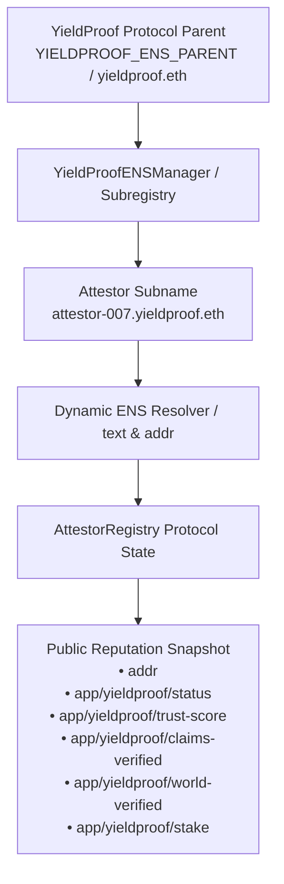

# ENSv2 Identity & Reputation Layer for YieldProof Attestors

## 1. Executive Summary

YieldProof integrates **ENSv2 (Ethereum Name Service v2)** to provide each approved and verified YieldProof attestor with a portable, human-readable decentralized identity and verifiable on-chain reputation profile.

Instead of relying strictly on raw hex addresses (`0x...`), each attestor can issue a subname under the protocol parent namespace:

$$\text{attestor-label}.\text{yieldproof.eth}$$

Crucially, **ENSv2 serves as a dynamic, read-resolvable identity abstraction**. Real-time protocol performance metrics (Trust Score, claims verified, human verification status, active stake) are queried dynamically without requiring expensive gas writes on every attestation vote.

---

## 2. Architecture & Name Hierarchy



### Hierarchy Breakdown:
1. **Parent Namespace**: Configured via `YIELDPROOF_ENS_PARENT` (defaults to `yieldproof.eth`).
2. **Subname Controller / Manager**: `YieldProofENSManager.sol` controls subname issuance, uniqueness, and resolution mapping.
3. **Subname Node**: `namehash(label + "." + parentName)`.
4. **Resolver**: Standard ENS `IENSResolver` compliant contract interface. The manager dynamically answers both `addr(bytes32 node)` and `text(bytes32 node, string key)`.

---

## 3. ENSv2 Dynamic Resolution vs. Static Storage

### Design Decision:
If YieldProof wrote to ENS text records on every single attestation, gas costs would mount exponentially for attestors. 

### Solution: Dynamic Resolution Architecture
`YieldProofENSManager` implements the standard ENS resolver functions `addr(bytes32)` and `text(bytes32, string)` by querying the live `AttestorRegistry` contract in real time:

```solidity
function text(bytes32 node, string calldata key) external view override returns (string memory) {
    address attestor = nodeToAttestor[node];
    if (attestor == address(0)) return customTexts[node][key];

    // Dynamic resolution keys:
    if (keccak256(bytes(key)) == keccak256(bytes("app/yieldproof/status"))) {
        (bool isRegistered, uint256 stake, , , ) = attestorRegistry.attestors(attestor);
        return isRegistered ? (stake > 0 ? "Active" : "Registered") : "Inactive";
    }
    if (keccak256(bytes(key)) == keccak256(bytes("app/yieldproof/trust-score"))) {
        (,,,,uint256 trustScore) = attestorRegistry.getAttestorStats(attestor);
        return Strings.toString(trustScore);
    }
    if (keccak256(bytes(key)) == keccak256(bytes("app/yieldproof/world-verified"))) {
        return attestorRegistry.isWorldIdVerified(attestor) ? "true" : "false";
    }
    if (keccak256(bytes(key)) == keccak256(bytes("app/yieldproof/claims-verified"))) {
        (,uint256 successful,,,) = attestorRegistry.getAttestorStats(attestor);
        return Strings.toString(successful);
    }
    
    return customTexts[node][key];
}
```

This guarantees that:
- **ENS queries anywhere in the Ethereum ecosystem always return up-to-the-second verified data**.
- **No additional gas cost is incurred during daily verification workflows**.
- **Custom text records can still be written if desired by the authorized attestor**.

---

## 4. Exposed Public Records

| ENS Record Key | Example Value | Description |
| :--- | :--- | :--- |
| `addr` | `0x7099...79C8` | Attestor wallet address |
| `app/yieldproof/status` | `"Active"` | Protocol status (`Active`, `Registered`, `Inactive`) |
| `app/yieldproof/trust-score` | `"94"` | Dynamic trust score calculated from attestation accuracy (0–100) |
| `app/yieldproof/world-verified` | `"true"` | Cryptographic proof of unique humanness via World ID ZK-SNARK |
| `app/yieldproof/claims-verified` | `"27"` | Count of successfully verified RWA yield claims |
| `app/yieldproof/stake` | `"2000000000000000000"` | Active MNT staking balance (in wei) |

> **Privacy Guarantee**: No PII, private keys, or biometric data are ever written into ENS records. World ID nullifier hashes remain safely abstracted on-chain.

---

## 5. Permissions & Enhanced Access Control

ENSv2 utilizes fine-grained access control principles:

1. **Subname Creation**:
   - Only registered, approved YieldProof attestors (`AttestorRegistry.attestors(caller).isRegistered == true`) can call `createAttestorSubname` or `autoCreateAttestorSubname`.
   - Non-attestor or Sybil wallets cannot claim `*.yieldproof.eth` subnames.
   - Subnames are strictly 1-to-1 per attestor wallet. Duplicate names are rejected with `SubnameAlreadyRegistered`.

2. **Record Modification**:
   - Dynamic records are immutable protocol reflections.
   - Custom text records via `setText(node, key, value)` can only be set by the **contract owner** or the **registered attestor owner** of that specific subname node (`Unauthorized`).

3. **Frontend Boundary**:
   - The frontend never has root or parent registry ownership. It executes transactions signed by the user's wallet via Wagmi/Viem.

---

## 6. ENS Normalization & Tooling

In accordance with ENS standards (UTS-46 / ENSIP-15):
- All names are normalized prior to hashing using Viem's `normalize`:
  ```typescript
  import { normalize } from "viem/ens";
  
  export function safeNormalizeENS(name: string): string {
    try {
      return normalize(name.trim().toLowerCase());
    } catch {
      return name.trim().toLowerCase();
    }
  }
  ```
- Subname labels are validated for length, alphanumeric characters, and hyphens (no trailing hyphens or empty labels).

---

## 7. Environment Variables

| Variable | Default | Purpose |
| :--- | :--- | :--- |
| `NEXT_PUBLIC_ENS_PARENT_NAME` | `yieldproof.eth` | Parent domain name for subname issuance |
| `NEXT_PUBLIC_ENS_MANAGER_ADDRESS` | `0xB300d6D41c2f9a8fa3Fa3F0544EF829e4a33C12f` | Deployed `YieldProofENSManager` contract address |
| `YIELDPROOF_ENS_PARENT` | `yieldproof.eth` | Node/Backend parent namespace reference |

---

## 8. Sepolia & Mantle Deployment

### Sepolia Testing Strategy:
1. On Ethereum Sepolia, the parent domain (e.g. `yieldproof.eth` or `yieldproof-test.eth`) points its subregistry/resolver to `YieldProofENSManager`.
2. Universal Resolver queries `resolve(bytes name, bytes data)` which routes to `YieldProofENSManager.text` or `addr`.
3. On Mantle Testnet / local environments, `YieldProofENSManager` acts as the self-contained resolver and subname registry for demo and cross-chain indexers.

---

## 9. Testing & Validation

All 9 dedicated ENS test cases pass in the contract test suite:

1. **Subname Creation**: Verified attestor issues `attestor-007.yieldproof.eth`.
2. **Deterministic Auto-Assignment**: Issues sequential subname `attestor-1.yieldproof.eth`.
3. **Duplicate Prevention**: Reverts on duplicate label collision.
4. **Unauthorized Wallet Rejection**: Non-registered wallet is prevented from creating subnames.
5. **Address Resolution**: Standard `addr(node)` returns the attestor's address.
6. **Dynamic Text Records**: Resolves `app/yieldproof/status`, `trust-score`, `world-verified`, `claims-verified`, `stake`.
7. **Access Control**: Rejects unauthorized `setText` modifications.
8. **Custom Text Records**: Attestor can write permitted custom metadata.
9. **Full Profile Aggregation**: `getAttestorProfile(fullName)` returns complete verified profile in a single call.
