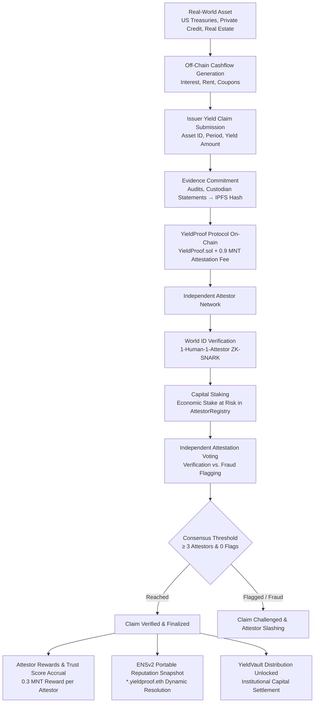

# YieldProof — RWA Architecture & Tokenization Verification

## 1. Overview

YieldProof provides on-chain verification infrastructure for Real-World Asset (RWA) tokenization. 

In tokenized RWA markets (such as tokenized US Treasury bills, private credit portfolios, and real estate debt), asset performance and cashflows occur primarily **off-chain** (in commercial banks, legal special purpose vehicles, or custodian accounts). 

YieldProof solves the **RWA Oracle & Accountability Gap**: establishing cryptographic and cryptoeconomic consensus over off-chain yield disclosures before on-chain capital pools and vault contracts release funds.

---

## 2. Complete RWA Verification Pipeline

---

## 3. Core RWA Product Model

### 1. What is the Real-World Asset?
YieldProof verifies tokenized RWA classes:
* **Tokenized Sovereign Debt**: e.g. Short-term US Treasury Bills generating risk-free yield.
* **Tokenized Private Credit & Trade Finance**: e.g. Corporate invoice factoring, accounts receivable.
* **Tokenized Real Estate Debt**: e.g. Commercial real estate rental distributions and mortgage notes.

### 2. What Yield Claim is Being Verified?
The issuer submits an explicit claim specifying:
* **`assetId`**: Standard asset identifier (e.g. `RWA-TBILL-2026-Q1`, `INVOICE-CREDIT-770`).
* **`period`**: Accounting period (e.g. `Jan 01 2026 - Mar 31 2026`).
* **`yieldAmount`**: The quantitative yield generated in native currency units (e.g. `200 MNT`).

### 3. Who Submits the Claim?
The **RWA Issuer** or **Asset Originator** submits the disclosure and pays an upfront attestation fee (`0.9 MNT`) to fund the verification pool.

### 4. Who Attests?
Independent decentralized attestors who have:
1. Proven unique humanness via **World ID zero-knowledge proofs** (mitigating Sybil vote manipulation).
2. Staked economic collateral (`MNT`) in `AttestorRegistry.sol`.

### 5. What Evidence is Provided?
Issuers upload cryptographic evidence:
* Custodian account confirmations.
* Independent auditor attestation reports.
* Bank wire receipts and trustee certifications.

### 6. How is Evidence Committed?
Evidence files are uploaded to decentralized storage (IPFS via Pinata). The immutable Content Identifier (`ipfs://bafy...`) is committed on-chain in the `documentHash` field of `YieldClaim`.

### 7. How Does Staking Create Economic Accountability?
Attestors must maintain an active stake balance. By voting to approve a claim, the attestor puts their reputation and stake on the line. If a claim is flagged and proven fraudulent, dishonest attestors can be slashed via `slash()`.

### 8. How Does Consensus Work?
YieldProof enforces multi-party threshold consensus:
* **Threshold**: A minimum of **3 independent attestors** (`MIN_REQUIRED_ATTESTORS = 3`) must independently review the evidence and cast their vote.
* **Flagging Protection**: Any attestor can call `flagClaim(claimId, reason)`. A flagged claim immediately halts the consensus pipeline until dispute resolution occurs.

### 9. How Does the Result Become Useful?
Once a claim achieves verified consensus:
1. **Downstream Capital Execution**: `YieldVault.sol` allows institutional investors to trigger `unlockYield(claimId)`, automatically distributing verified yield payouts to vault liquidity providers.
2. **Decentralized Reputation**: The attestors' verified track record updates dynamically on their **ENSv2 identity** (`*.yieldproof.eth`), providing portable on-chain credit.
