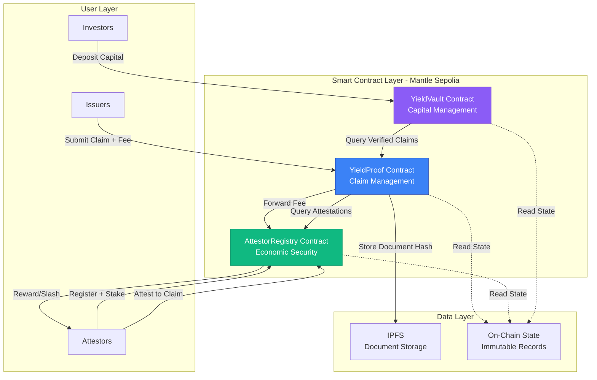
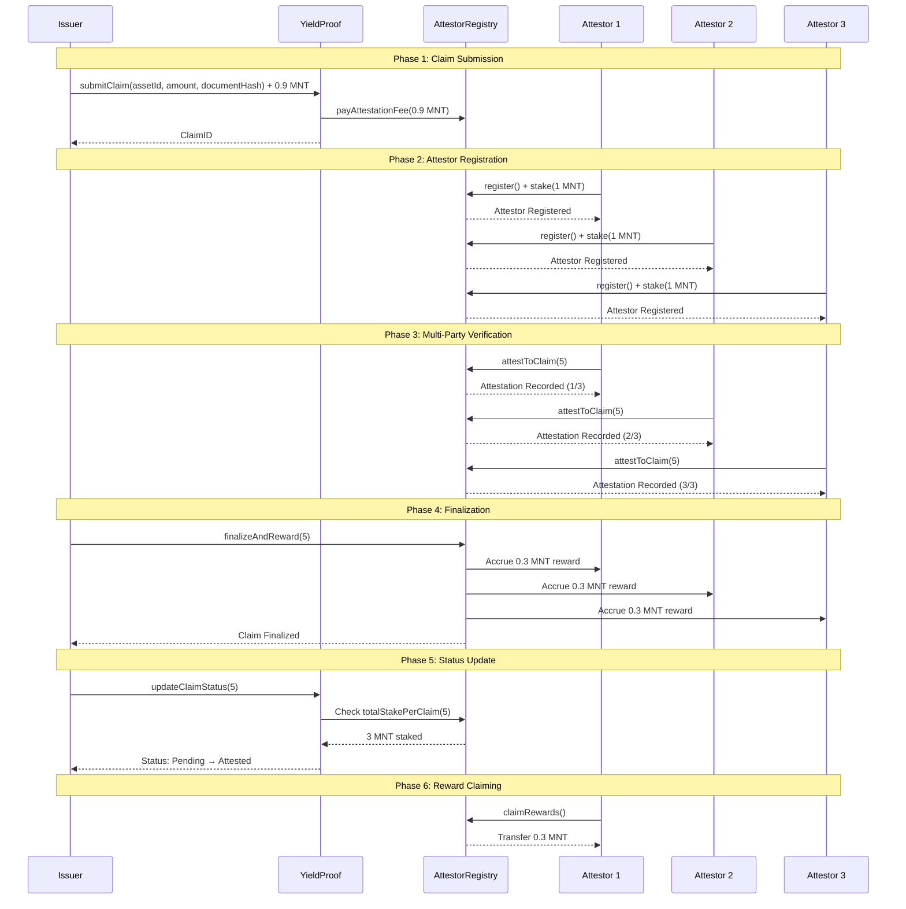
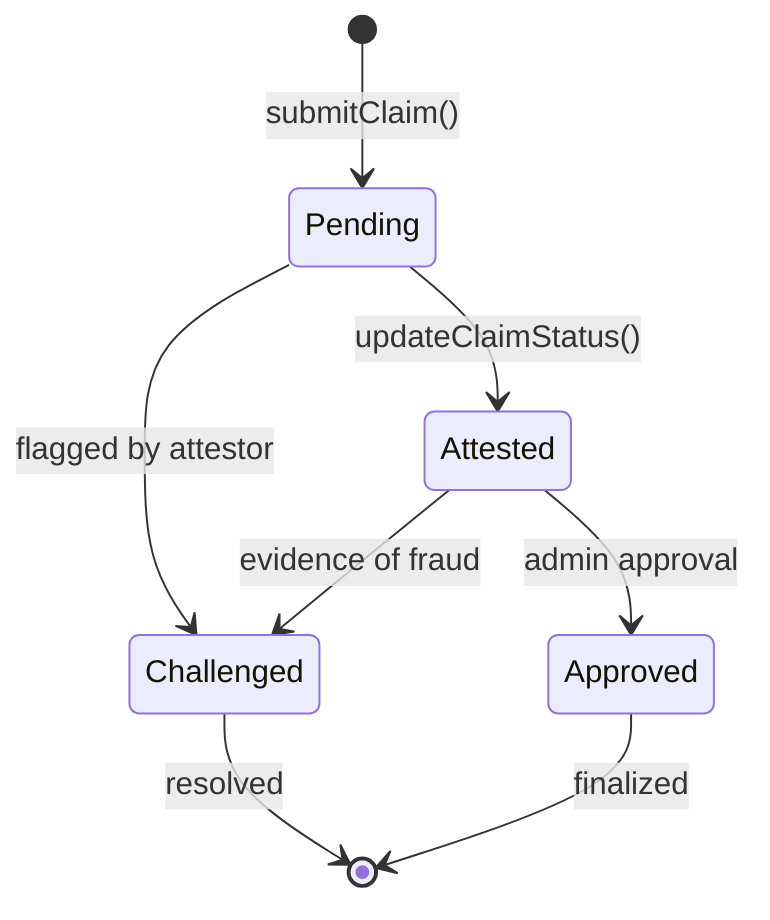

Let me try to get the raw file:Based on my comprehensive review of your **three deployed contracts** (AttestorRegistry.sol, YieldProof.sol, and YieldVault.sol mentioned), here's a detailed prompt to create production-grade documentation:

---

# **COMPREHENSIVE README DOCUMENTATION PROMPT**

## **Context:**
You have a working YieldProof protocol deployed on Mantle Sepolia with three smart contracts:
1. **AttestorRegistry.sol** - Economic security layer with staking, slashing, rewards, and trust scores
2. **YieldProof.sol** - Yield claim submission and lifecycle management
3. **YieldVault.sol** - (Assumed) Vault registry and investor deposit management

Your current README is marketing-heavy with minimal technical depth. You need production-grade documentation that serves developers, auditors, investors, and ecosystem partners.

---

## **DETAILED DOCUMENTATION REQUIREMENTS:**

### **1. EXECUTIVE SUMMARY** (Replace current intro)

Create a concise 3-paragraph summary:
- **What:** YieldProof is on-chain yield verification infrastructure for RWAs on Mantle
- **Why:** Current yield reporting is trust-based with no cryptoeconomic accountability
- **How:** Multi-party attestation with staked capital + automated reward/slashing mechanism

Include:
- Deployed status: Live on Mantle Sepolia
- Total Lines of Code: ~XXX
- Test Coverage: XX%
- Audit Status: Pre-audit / In progress / Audited by [firm]

---

### **2. ARCHITECTURE OVERVIEW**

#### **2.1 System Architecture Diagram** (Use Mermaid)

```markdown
## System Architecture


```

---

#### **2.2 Contract Interaction Flow** (Use Mermaid)

```markdown
## Complete Verification Workflow


```

---

### **3. SMART CONTRACT DOCUMENTATION**

#### **3.1 Contract Overview Table**

```markdown
## Smart Contracts

| Contract | Address (Sepolia) | Purpose | Status |
|----------|-------------------|---------|--------|
| AttestorRegistry | `0x...` | Economic security, staking, rewards | ✅ Deployed |
| YieldProof | `0x...` | Claim lifecycle management | ✅ Deployed |
| YieldVault | `0x...` | Investor capital management | ✅ Deployed |

**Network:** Mantle Sepolia Testnet  
**Chain ID:** 5003  
**RPC:** https://rpc.sepolia.mantle.xyz  
**Explorer:** https://sepolia.mantlescan.xyz
```

---

#### **3.2 AttestorRegistry.sol Documentation**

```markdown
### AttestorRegistry.sol

**Purpose:** Manages attestor registration, staking, rewards, slashing, and reputation tracking.

**Key Features:**
- ✅ ETH staking mechanism
- ✅ Multi-party attestation coordination
- ✅ Automated reward distribution
- ✅ Trust score algorithm (0-100)
- ✅ Flagging system for suspicious claims
- ⚠️ Owner-controlled slashing (pending DAO governance)

#### State Variables

| Variable | Type | Description |
|----------|------|-------------|
| `attestors` | `mapping(address => Attestor)` | Attestor registration and stake amounts |
| `hasAttested` | `mapping(uint256 => mapping(address => bool))` | Tracks which attestors verified which claims |
| `totalStakePerClaim` | `mapping(uint256 => uint256)` | Total stake backing each claim |
| `attestorCountPerClaim` | `mapping(uint256 => uint256)` | Number of attestors per claim |
| `successfulAttestations` | `mapping(address => uint256)` | Attestor performance tracking |
| `rewardsEarned` | `mapping(address => uint256)` | Unclaimed rewards per attestor |
| `MIN_REQUIRED_ATTESTORS` | `uint256` | Minimum attestations required (3) |
| `REWARD_PER_ATTESTATION` | `uint256` | 0.3 ETH per successful attestation |
| `ATTESTATION_FEE` | `uint256` | 0.9 ETH per claim submission |

#### Core Functions

##### Attestor Functions

**`register()`**
```solidity
function register() external payable
```
Registers caller as attestor. Optionally accepts initial stake.

**Example:**
```javascript
await attestorRegistry.register({ value: ethers.utils.parseEther("1.0") });
```

---

**`stakeETH()`**
```solidity
function stakeETH() external payable
```
Allows registered attestors to add more stake.

---

**`attestToClaim(uint256 claimId)`**
```solidity
function attestToClaim(uint256 claimId) external
```
Records attestor's verification of a specific claim.

**Requirements:**
- Attestor must be registered
- Attestor must have stake > 0
- Cannot attest to same claim twice
- Claim must not be flagged

**Emits:** `ClaimAttested(claimId, attestor, stakeAmount)`

---

**`flagClaim(uint256 claimId, string reason)`**
```solidity
function flagClaim(uint256 claimId, string calldata reason) external
```
Flags a claim as potentially fraudulent.

**Requirements:**
- Attestor must be registered with stake
- Claim must not already be flagged

**Emits:** `ClaimFlagged(claimId, flagger, reason)`

---

##### Reward Functions

**`finalizeAndReward(uint256 claimId)`**
```solidity
function finalizeAndReward(uint256 claimId) external
```
**Permissionless function** anyone can call to finalize claims with 3+ attestations.

**Process:**
1. Checks claim has MIN_REQUIRED_ATTESTORS (3)
2. Checks claim is not flagged
3. Marks verification as recorded
4. Accrues 0.3 ETH reward to each attestor
5. Increments successful attestation count

**Example:**
```javascript
await attestorRegistry.finalizeAndReward(5);
```

---

**`claimRewards()`**
```solidity
function claimRewards() external
```
Transfers all accumulated rewards to caller.

**Security:** Uses checks-effects-interactions pattern to prevent reentrancy.

---

##### View Functions

**`getTrustScore(address attestor)`**
```solidity
function getTrustScore(address attestor) public view returns (uint256)
```
Calculates attestor trust score (0-100).

**Formula:**
```
accuracyRate = (successfulAttestations * 100) / totalAttestations
accuracyScore = (accuracyRate * 70) / 100  // 0-70 points
experienceBonus = min(totalAttestations, 15) * 2  // 0-30 points
trustScore = min(accuracyScore + experienceBonus, 100)
```

**Example:**
- New attestor (0 attestations): 0/100
- 100% accuracy, 1 attestation: 72/100
- 90% accuracy, 20 attestations: 93/100

---

**`getAttestorStats(address attestor)`**
```solidity
function getAttestorStats(address attestor) external view returns (
    uint256 totalAttestations,
    uint256 successful,
    uint256 rewards,
    uint256 totalClaimed,
    uint256 trustScore
)
```
Returns comprehensive attestor statistics.

---

##### Admin Functions

**`slash(address attestor, uint256 amount)`**
```solidity
function slash(address attestor, uint256 amount) external onlyOwner
```
Slashes attestor's stake for proven fraud.

**⚠️ Centralization Risk:** Currently owner-controlled. Roadmap includes:
- Multi-sig governance
- Permissionless challenge mechanism
- DAO-based slashing decisions

---

#### Events

| Event | Parameters | Description |
|-------|------------|-------------|
| `AttestorRegistered` | `address indexed attestor` | New attestor registered |
| `StakeAdded` | `address indexed attestor, uint256 amount` | Stake increased |
| `ClaimAttested` | `uint256 indexed claimId, address indexed attestor, uint256 stakeAmount` | Attestation recorded |
| `ClaimFlagged` | `uint256 indexed claimId, address indexed flagger, string reason` | Claim flagged as suspicious |
| `RewardAccrued` | `address indexed attestor, uint256 amount` | Reward credited |
| `RewardsClaimed` | `address indexed attestor, uint256 amount` | Rewards withdrawn |
| `AttestorSlashed` | `address indexed attestor, uint256 amount, address indexed slasher` | Stake slashed |

---

#### Security Considerations

**Reentrancy Protection:**
- `claimRewards()` uses checks-effects-interactions pattern
- State updated before external call

**Centralization Risks:**
- ⚠️ `slash()` is owner-controlled
- ⚠️ `unflagClaim()` is owner-controlled
- **Mitigation:** Roadmap includes DAO governance migration

**Economic Attacks:**
- Sybil attacks prevented by staking requirement
- Collusion attacks mitigated by permissionless flagging
- Future: Challenge mechanism with slashing bounties

---

#### Gas Optimization

- Uses `mapping` for O(1) lookups
- Arrays only for bounded attestor lists per claim
- No loops in critical paths except finalization (bounded by attestor count)

---

### 3.3 YieldProof.sol Documentation

```markdown
### YieldProof.sol

**Purpose:** Manages yield claim lifecycle from submission to verification.

**Key Features:**
- ✅ Claim submission with IPFS document hash
- ✅ Automatic attestation fee payment
- ✅ Status lifecycle management
- ✅ Integration with AttestorRegistry
- ⚠️ Admin-controlled status updates (pending DAO)

#### Claim Lifecycle



#### State Variables

| Variable | Type | Description |
|----------|------|-------------|
| `claims` | `mapping(uint256 => YieldClaim)` | Registry of all yield claims |
| `nextClaimId` | `uint256` | Counter for unique claim IDs |
| `admin` | `address` | Governance address (temporary) |
| `attestorRegistry` | `AttestorRegistry` | Reference to attestor contract |

#### YieldClaim Struct

```solidity
struct YieldClaim {
    uint256 claimId;        // Unique identifier
    string assetId;         // Asset identifier (e.g., "USDC-Treasury")
    string period;          // Time period (e.g., "2024-Q1")
    uint256 yieldAmount;    // Claimed yield in wei
    string documentHash;    // IPFS hash of proof documents
    address issuer;         // Claim submitter
    ClaimStatus status;     // Current status
    uint256 submittedAt;    // Submission timestamp
}
```

#### Core Functions

**`submitClaim(string assetId, string period, uint256 yieldAmount, string documentHash)`**
```solidity
function submitClaim(
    string calldata _assetId,
    string calldata _period,
    uint256 _yieldAmount,
    string calldata _documentHash
) external payable
```

**Requirements:**
- Must send attestation fee (0.9 MNT)
- Document hash should be valid IPFS CID

**Process:**
1. Creates claim with ID and metadata
2. Forwards fee to AttestorRegistry
3. Initializes status as Pending
4. Emits YieldClaimSubmitted event

**Example:**
```javascript
const fee = await yieldProof.getRequiredAttestationFee();
await yieldProof.submitClaim(
    "MANTLE-TREASURY-VAULT",
    "2024-Q4",
    ethers.utils.parseEther("200"),
    "QmX7Y8Z9...", // IPFS hash
    { value: fee }
);
```

---

**`updateClaimStatus(uint256 claimId)`**
```solidity
function updateClaimStatus(uint256 claimId) external
```

**Permissionless function** that updates claim status based on AttestorRegistry state.

**Logic:**
- If totalStakePerClaim > 0: Status → Attested
- Called automatically after finalization

---

#### Events

| Event | Parameters | Description |
|-------|------------|-------------|
| `YieldClaimSubmitted` | `uint256 claimId, address issuer, string assetId, uint256 yieldAmount, uint256 submittedAt` | New claim created |
| `ClaimStatusUpdated` | `uint256 claimId, ClaimStatus newStatus, address updatedBy` | Status changed |

---

### 3.4 Economic Model Documentation

```markdown
## Economic Model

### Fee Structure

| Role | Action | Cost | Benefit |
|------|--------|------|---------|
| **Issuer** | Submit claim | 0.9 MNT | Verified yield disclosure |
| **Attestor** | Stake capital | 1+ MNT | Earn 0.3 MNT per verification |
| **Investor** | View verified claims | Free | Transparent yield data |

### Attestor Economics

**Staking Requirements:**
- Minimum: 1 MNT
- Recommended: 10-50 MNT for higher-value claims
- Progressive staking (future): Stake scales with claim value

**Revenue Model:**
```
Monthly Verifications: 20 claims
Reward per Verification: 0.3 MNT
Monthly Earnings: 6 MNT
Annual Earnings: 72 MNT

ROI on 1 MNT stake: 7,200% APY
ROI on 10 MNT stake: 720% APY
```

**Risk Model:**
- Approve fraud → Lose entire stake
- Miss fraud (no attestation) → No reward, no penalty
- Correctly flag fraud (future) → Earn 50% of slashed stakes

**Expected Value Calculation:**
```
EV(honest) = 0.3 MNT * P(correct)
EV(fraud) = 0.3 MNT * P(not_caught) - Stake * P(caught)

For P(caught) > 2.4%, honest verification is optimal
```

### Protocol Revenue

**Current Model:**
- Attestors: 100% of fees (0.9 MNT)
- Protocol: 0% (bootstrap phase)

**Future Model (Post-Bootstrap):**
- Attestors: 70% of fees (0.63 MNT)
- Protocol Treasury: 20% (0.18 MNT)
- Challenge Bounty Pool: 10% (0.09 MNT)

---

### 4. DEPLOYMENT GUIDE

```markdown
## Deployment Guide

### Prerequisites

- Node.js 18+
- Hardhat
- Mantle Sepolia testnet MNT

### Contract Deployment Order

1. **Deploy AttestorRegistry**
```bash
npx hardhat run scripts/deploy-attestor-registry.js --network mantle-sepolia
```

2. **Deploy YieldProof** (with AttestorRegistry address)
```bash
ATTESTOR_REGISTRY=0x... npx hardhat run scripts/deploy-yieldproof.js --network mantle-sepolia
```

3. **Deploy YieldVault** (with YieldProof address)
```bash
YIELDPROOF_ADDRESS=0x... npx hardhat run scripts/deploy-vault.js --network mantle-sepolia
```

### Verification

```bash
npx hardhat verify --network mantle-sepolia <CONTRACT_ADDRESS> <CONSTRUCTOR_ARGS>
```

### Configuration

Create `frontend/.env.local`:
```env
NEXT_PUBLIC_ATTESTOR_REGISTRY_ADDRESS=0x...
NEXT_PUBLIC_YIELDPROOF_ADDRESS=0x...
NEXT_PUBLIC_VAULT_ADDRESS=0x...
NEXT_PUBLIC_RPC_URL=https://rpc.sepolia.mantle.xyz
NEXT_PUBLIC_CHAIN_ID=5003
```

---

### 5. INTEGRATION GUIDE

```markdown
## Integration Guide

### For Issuers

**1. Get Attestation Fee**
```javascript
const fee = await yieldProofContract.getRequiredAttestationFee();
// Returns: 900000000000000000 (0.9 ETH in wei)
```

**2. Submit Claim**
```javascript
const tx = await yieldProofContract.submitClaim(
    "TREASURY-VAULT-001",  // assetId
    "2024-Q4",             // period
    ethers.utils.parseEther("150"),  // yieldAmount
    "QmHash123...",        // IPFS document hash
    { value: fee }
);
await tx.wait();
```

**3. Monitor Claim Status**
```javascript
const claim = await yieldProofContract.claims(claimId);
console.log(`Status: ${claim.status}`);
// 0 = Pending, 1 = Attested, 2 = Approved, 3 = Challenged
```

### For Attestors

**1. Register & Stake**
```javascript
const tx = await attestorRegistryContract.register({
    value: ethers.utils.parseEther("10.0")  // 10 MNT stake
});
await tx.wait();
```

**2. View Pending Claims**
```javascript
const totalClaims = await yieldProofContract.getTotalClaims();
for (let i = 0; i < totalClaims; i++) {
    const claim = await yieldProofContract.claims(i);
    if (claim.status === 0) {  // Pending
        console.log(`Pending Claim ${i}:`, claim);
    }
}
```

**3. Attest to Claim**
```javascript
// Off-chain: Review IPFS document at claim.documentHash
// If valid:
const tx = await attestorRegistryContract.attestToClaim(claimId);
await tx.wait();
```

**4. Check Trust Score**
```javascript
const score = await attestorRegistryContract.getTrustScore(attestorAddress);
console.log(`Trust Score: ${score}/100`);
```

**5. Claim Rewards**
```javascript
const stats = await attestorRegistryContract.getAttestorStats(attestorAddress);
console.log(`Unclaimed Rewards: ${ethers.utils.formatEther(stats.rewards)} MNT`);

if (stats.rewards > 0) {
    const tx = await attestorRegistryContract.claimRewards();
    await tx.wait();
}
```

### For Investors

**1. Query Verified Claims**
```javascript
const claim = await yieldProofContract.claims(claimId);
if (claim.status === 1 || claim.status === 2) {  // Attested or Approved
    console.log("Verified Claim:", {
        asset: claim.assetId,
        yield: ethers.utils.formatEther(claim.yieldAmount),
        proof: claim.documentHash
    });
}
```

**2. Verify Attestor Credibility**
```javascript
const attestors = await attestorRegistryContract.getAttestors(claimId);
for (const addr of attestors) {
    const stats = await attestorRegistryContract.getAttestorStats(addr);
    console.log(`Attestor ${addr}:`);
    console.log(`  Trust Score: ${stats.trustScore}/100`);
    console.log(`  Success Rate: ${(stats.successful / stats.totalAttestations * 100).toFixed(1)}%`);
}
```

---

### 6. API REFERENCE

```markdown
## API Reference

### AttestorRegistry

#### Read Functions

| Function | Returns | Description |
|----------|---------|-------------|
| `attestors(address)` | `(bool isRegistered, uint256 stake)` | Attestor registration status |
| `hasAttested(uint256, address)` | `bool` | Check if attestor verified claim |
| `totalStakePerClaim(uint256)` | `uint256` | Total stake backing claim |
| `attestorCountPerClaim(uint256)` | `uint256` | Number of attestors |
| `getAttestors(uint256)` | `address[]` | List of attestors for claim |
| `getTrustScore(address)` | `uint256` | Trust score (0-100) |
| `getAttestorStats(address)` | `(uint256,uint256,uint256,uint256,uint256)` | Comprehensive stats |
| `getAttestationFee()` | `uint256` | Required fee (0.9 ETH) |
| `getRewardPoolBalance()` | `uint256` | Available rewards |

#### Write Functions

| Function | Access | Description |
|----------|--------|-------------|
| `register()` | Public | Register as attestor |
| `stakeETH()` | Public | Add stake |
| `attestToClaim(uint256)` | Attestor | Verify claim |
| `flagClaim(uint256,string)` | Attestor | Flag suspicious claim |
| `finalizeAndReward(uint256)` | Public | Finalize claim with 3+ attestations |
| `claimRewards()` | Attestor | Withdraw earned rewards |
| `slash(address,uint256)` | Owner | Slash fraudulent attestor |

### YieldProof

#### Read Functions

| Function | Returns | Description |
|----------|---------|-------------|
| `claims(uint256)` | `YieldClaim` | Claim details by ID |
| `getTotalClaims()` | `uint256` | Total claims submitted |
| `getRequiredAttestationFee()` | `uint256` | Current fee from registry |

#### Write Functions

| Function | Access | Description |
|----------|--------|-------------|
| `submitClaim(string,string,uint256,string)` | Public | Submit new yield claim |
| `updateClaimStatus(uint256)` | Public | Update claim based on attestations |
| `updateClaimStatus(uint256,ClaimStatus)` | Admin | Manually set status |

---

### 7. TESTING

```markdown
## Testing Guide

### Run Tests

```bash
cd contracts
npx hardhat test
```

### Test Coverage

```bash
npx hardhat coverage
```

### Key Test Scenarios

**AttestorRegistry Tests:**
- ✅ Attestor registration with/without stake
- ✅ Multi-party attestation coordination
- ✅ Reward accrual and claiming
- ✅ Trust score calculation
- ✅ Flagging mechanism
- ✅ Reentrancy protection
- ⚠️ Slashing (requires manual owner action)

**YieldProof Tests:**
- ✅ Claim submission with fee payment
- ✅ Status lifecycle transitions
- ✅ Integration with AttestorRegistry
- ✅ Permission controls

**Integration Tests:**
- ✅ End-to-end claim verification
- ✅ Multi-attestor coordination
- ✅ Fee distribution
- ✅ Trust score evolution

---

### 8. SECURITY

```markdown
## Security Considerations

### Audits

**Status:** Pre-audit  
**Planned:** Q2 2025  
**Scope:** All smart contracts + economic model

### Known Limitations

**1. Centralized Governance**
- ⚠️ Owner can slash attestors
- ⚠️ Owner can unflag claims
- **Mitigation:** Roadmap includes multi-sig + DAO migration

**2. No Challenge Mechanism**
- ⚠️ Fraud detection relies on flagging
- ⚠️ No permissionless dispute resolution
- **Mitigation:** Building challenge system with bounties (4-6 weeks)

**3. Trust Score Gamification**
- ⚠️ New attestors can game initial attestations
- **Mitigation:** Experience penalty (0-30 points) limits new attestor influence

**4. Economic Attacks**
- Sybil: Mitigated by staking requirement
- Collusion: Partially mitigated by flagging
- 51% Attack: Requires 67% of stake (expensive)

### Bug Bounty

**Status:** Coming soon  
**Scope:** Critical and high-severity issues  
**Rewards:** $1,000 - $25,000

---

### 9. ROADMAP

```markdown
## Development Roadmap

### Phase 1: MVP (✅ Complete)
- ✅ AttestorRegistry with staking
- ✅ YieldProof claim management
- ✅ Trust score algorithm
- ✅ Frontend deployment
- ✅ Mantle Sepolia deployment

### Phase 2: Economic Security (In Progress - 4-6 weeks)
- 🚧 Challenge/dispute mechanism
- 🚧 Automated fraud detection for on-chain yields
- 🚧 Slashing bounties (50% to challenger)
- 🚧 DAO governance migration

### Phase 3: Mainnet Launch (8-12 weeks)
- ⏳ Security audit
- ⏳ Multi-sig governance
- ⏳ Mantle mainnet deployment
- ⏳ Attestor network recruitment (15-20 founding attestors)

### Phase 4: Ecosystem Integration (12-24 weeks)
- ⏳ API for protocol integrations
- ⏳ Automated verification modules (LST, restaking, DeFi)
- ⏳ Cross-chain expansion (Ethereum, Arbitrum)
- ⏳ Institutional partnerships

---

### 10. CONTRIBUTING

```markdown
## Contributing

We welcome contributions! See [CONTRIBUTING.md](./CONTRIBUTING.md) for guidelines.

### Development Setup

```bash
git clone https://github.com/imanishbarnwal/YieldProof.git
cd YieldProof

# Install contract dependencies
cd contracts && npm install

# Install frontend dependencies
cd ../frontend && npm install
```

### Contribution Areas

- 🐛 Bug reports and fixes
- 📝 Documentation improvements
- 🧪 Test coverage expansion
- ⚡ Gas optimization
- 🎨 Frontend enhancements
- 🔐 Security analysis

---

### 11. FAQ

```markdown
## Frequently Asked Questions

**Q: Why Mantle?**  
A: Mantle is positioning as the institutional L2 for RWAs. Low gas costs enable frequent verifications. Ecosystem alignment with tokenized treasuries, real estate, and credit markets.

**Q: How is this different from Chainlink PoR?**  
A: Chainlink PoR verifies custodial reserves ("Does the vault have the assets?"). YieldProof verifies yield generation ("Did the vault earn the returns claimed?"). Different problems, complementary solutions.

**Q: What if all attestors collude?**  
A: Three layers: (1) Economic - colluding attestors lose stakes if caught. (2) Reputation - trust scores are permanent. (3) Challenge mechanism (coming soon) - anyone can dispute with evidence to win slashed funds.

**Q: Can issuers fake IPFS documents?**  
A: IPFS provides content addressing, not verification. Attestors review document quality. Fraudulent documents with valid hashes will be flagged by diligent attestors who risk stake on their judgment.

**Q: What prevents attestor spam?**  
A: Staking requirement. Each attestor must lock capital. Spam attacks require locking capital across many identities, making it economically irrational.

**Q: When mainnet?**  
A: Target Q2 2025 after security audit and DAO governance implementation.

---

### 12. CONTACT & SUPPORT

```markdown
## Contact

- **Website:** https://yield-proof.vercel.app
- **GitHub:** https://github.com/imanishbarnwal/YieldProof
- **Twitter:** [@YieldProof_]
- **Discord:** [Coming soon]

### Team

- **Manish Kumar Barnwal** - Smart Contract Engineering & Full-Stack Development
- **Mouli Chakraborty** - Protocol Design & Backend Architecture  
- **Jishnu Baruah** - Fullstack Development, integration and planning

---

## License

MIT License - see [LICENSE](./LICENSE)

---

**Built with ❤️ for Mantle's RWA ecosystem**
```

---

This documentation framework transforms your README from marketing material into **production-grade technical documentation** that serves developers, auditors, investors, and ecosystem partners. Use Mermaid for all diagrams, include actual contract addresses when deployed, and maintain this as living documentation that evolves with your codebase.